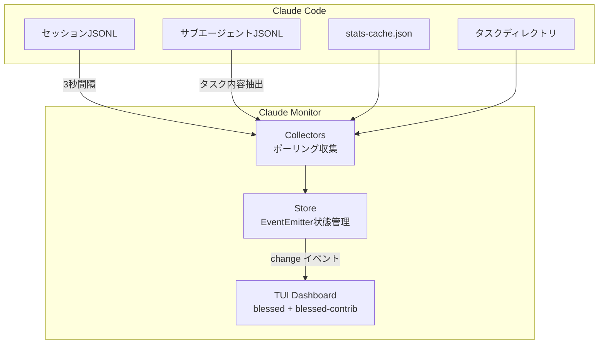
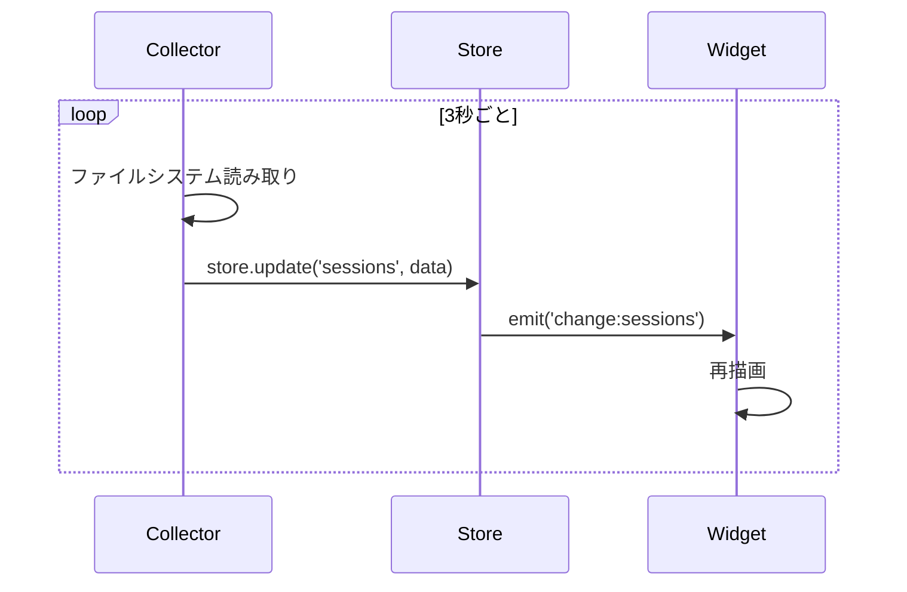
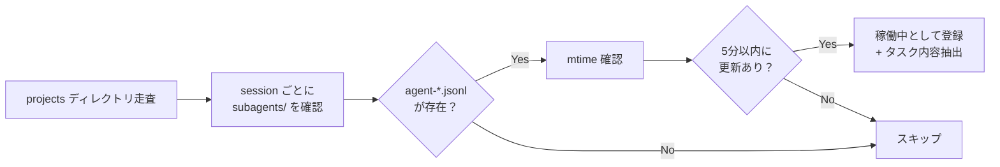
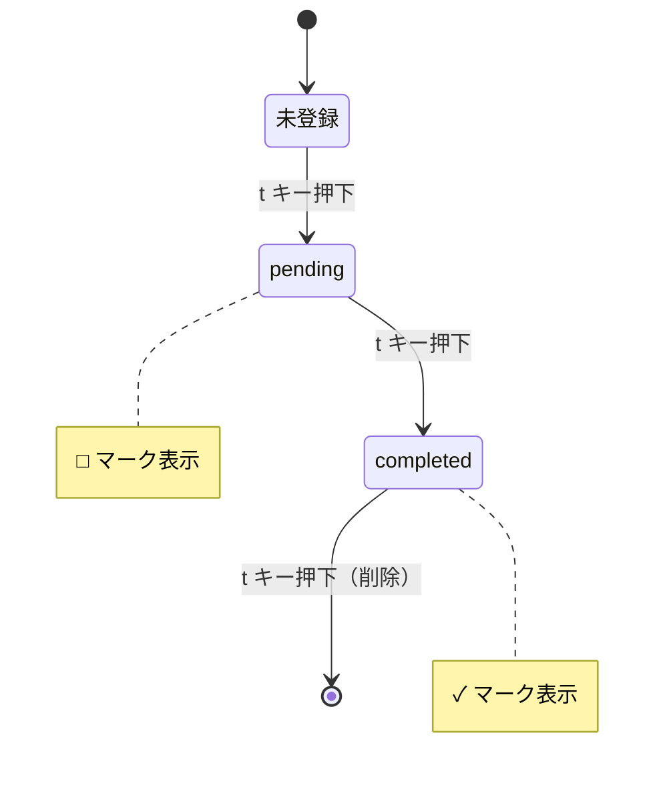

# Claude Code の稼働状況をリアルタイムで把握する監視ダッシュボードを作った話

## はじめに

Claude Code を業務で本格的に使い始めると、こんな疑問が湧いてきます。

- 「今日トークンどれくらい使った？」
- 「サブエージェントが何やってるか分からない」
- 「さっき何の作業してたっけ？次やることは？」

これらを**ターミナル1画面でリアルタイムに把握**できるTUIダッシュボード「**Claude Monitor**」を作りました。

> リポジトリ: [github.com/SimWook/claude-monitor](https://github.com/SimWook/claude-monitor)

## 動作イメージ

<!-- ここにスクリーンショットを貼り付け -->

## なぜ作ったのか

Claude Code はファイルシステムベースで動作しており、`~/.claude/` 配下にセッション情報、トークン消費量、タスク状態などが蓄積されます。しかし、これらの情報を確認するには個別にファイルを開く必要があり、**開発フロー中にリアルタイムで状況把握するのが困難**でした。

特にサブエージェント（Task tool）を複数起動している場合、各エージェントが何を担当しているかを把握する手段がありませんでした。

## 機能概要



### 7つのウィジェット

| ウィジェット | 何が分かるか |
|---|---|
| **ヘッダー** | 使用モデル、稼働セッション数、累計費用、エージェント数 |
| **作業履歴** | 全セッションの一覧。Branch、Summary、メッセージ数、経過時間 |
| **トークン効率** | Cache Hit率、Output比率、本日vs平均ペースの3ゲージ |
| **サブエージェント** | 稼働中エージェントのID、プロジェクト、**担当タスク内容**、経過時間 |
| **TODO** | 作業履歴から `t` キーで登録したTODOリスト。セッション間で永続化 |
| **トークン推移** | 7日間のキャッシュ vs I/O トークンのトレンドチャート |
| **日別消費量** | 7日間のトークン消費量をバーチャートで可視化 |

## 技術的なポイント

### 1. ファイルシステムからの情報抽出

Claude Code は `~/.claude/projects/` 配下にプロジェクトごとのディレクトリを持ち、各セッションはJSONL形式で記録されています。

```
~/.claude/
├── projects/
│   └── -Users-xxx-workspace/
│       ├── sessions-index.json       # セッション一覧
│       ├── {sessionId}.jsonl         # セッション会話ログ
│       └── {sessionId}/
│           └── subagents/
│               └── agent-{id}.jsonl  # サブエージェント会話ログ
└── stats-cache.json                  # 費用統計
```

サブエージェントの担当タスクは、エージェントJSONLファイルの**最初の行**（初回ユーザーメッセージ）から抽出しています。ファイル先頭の4KBだけ読み取るため、大きなファイルでも負荷は最小限です。

```javascript
// エージェントJSONLの最初の行からタスク内容を取得
function extractAgentTask(filePath) {
  const fd = openSync(filePath, 'r');
  const buf = Buffer.alloc(4096);
  const bytesRead = readSync(fd, buf, 0, 4096, 0);
  closeSync(fd);
  const line = buf.toString('utf8', 0, bytesRead).split('\n')[0];
  const obj = JSON.parse(line);
  return obj.message?.content?.slice(0, 200) || '';
}
```

### 2. EventEmitter ベースのリアクティブ更新

Store は Node.js の EventEmitter を継承しており、データ変更時に `change:{key}` イベントを発火します。各ウィジェットはこのイベントを購読して自律的に再描画します。



### 3. サブエージェント検出の仕組み



ファイルの更新時刻（mtime）が5分以内のエージェントを「稼働中」と判定します。これにより、完了したエージェントは自動的にリストから消えます。

### 4. TODO のライフサイクル

作業履歴テーブルで `t` キーを押すとTODO状態が遷移します。



TODOデータは `~/.claude-monitor-todos.json` に永続化されるため、ダッシュボードを再起動しても保持されます。

## セットアップ

```bash
# クローン & インストール
git clone https://github.com/SimWook/claude-monitor.git
cd claude-monitor
npm install

# 起動
node bin/claude-monitor.js on

# 停止
node bin/claude-monitor.js off
```

### Claude Code フックで自動起動

`~/.claude/hooks.json` に以下を追加すると、Claude Code 起動時にダッシュボードが自動で開きます。

```json
{
  "hooks": [
    {
      "matcher": "SessionStart",
      "hooks": [
        {
          "type": "command",
          "command": "node /path/to/claude-monitor/bin/claude-monitor.js on 2>/dev/null || true"
        }
      ]
    }
  ]
}
```

## ダッシュボードレイアウト

```
┌─────────────────── HEADER ────────────────────┐
│ CLAUDE MONITOR | モデル: opus 4.6 | 稼働中: 1  │
├────────────────────────┬──────────────────────┤
│                        │ トークン効率          │
│                        │  Cache命中 ████░ 80% │
│     作業履歴            │  出力比率  ██░░░ 12% │
│  (セッション一覧)       │  本日/平均 ███░░ 67% │
│  [t] でTODO切替        ├──────────────────────┤
│                        │ サブエージェント       │
│                        │  a8c3e2  5s workspace │
│                        │   ダッシュボード調査.. │
├────────────────────────┬──────────────────────┤
│                        │                      │
│  トークン推移 (7日間)    │  TODO (3件)          │
│  キャッシュ vs I/O      │  □ workspace 調査..  │
│                        │  ✓ Mikasa 認証実装   │
├────────────────────────┴──────────────────────┤
│  日別トークン消費量 (7日間)                      │
│  ▓▓▓ ▓▓ ▓▓▓▓ ▓▓▓ ▓▓ ▓▓▓▓ ▓▓               │
└───────────────────────────────────────────────┘
```

<!-- ここに実際のスクリーンショットを貼り付け -->

## 使用技術

| 技術 | 用途 |
|---|---|
| **Node.js** | ランタイム |
| **blessed / blessed-contrib** | ターミナルTUIフレームワーク |
| **EventEmitter** | リアクティブ状態管理 |
| **JSONL パース** | Claude Code セッションデータ読み取り |
| **ファイル mtime 監視** | エージェント稼働状態の判定 |

## 開発の経緯

このツールは Claude Code 自身を使って開発しました。初期のレイアウト設計からウィジェット実装、バグ修正、機能追加まで、すべて Claude Code との対話の中で段階的に構築しています。

開発中に得た知見:

1. **blessed-contrib の contrib.gaugeList は `stack` 配列が必須** — ドキュメントに記載がなく、ソースコードを読んで初めて分かった
2. **contrib.table の `rows.selected` は0始まり** — ヘッダー行は含まれない。オフバイワンエラーに注意
3. **Canvas系ウィジェット（line/bar）はリサイズ時に `calcSize()` が必要** — データを再セットすることで内部的に再計算される
4. **Ghostty ターミナルの `-e` フラグ** — 環境変数の設定は直接渡せないため、シェルラッパーが必要

## まとめ

Claude Code の可観測性を高めることで、AIエージェントとの協業がより効率的になります。特にサブエージェントの担当タスクが一目で分かることで、**何が並行で動いているかを把握しながら作業を進められる**ようになりました。

TODO機能により、Claude Code のセッション横断で「次にやること」を管理できるのも、日常のワークフローに組み込みやすいポイントです。

---

> リポジトリ: [github.com/SimWook/claude-monitor](https://github.com/SimWook/claude-monitor)
>
> ライセンス: MIT
