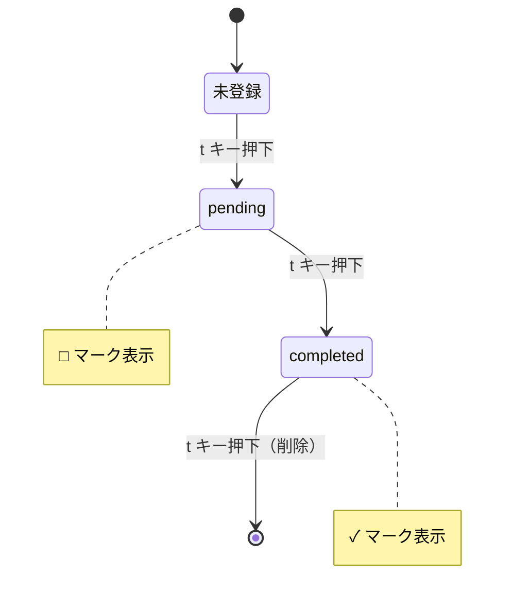
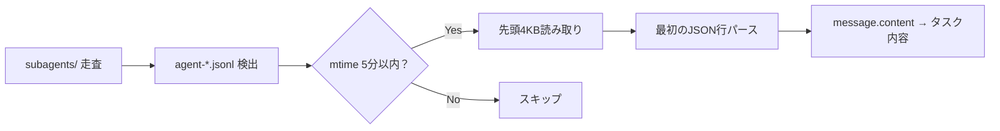
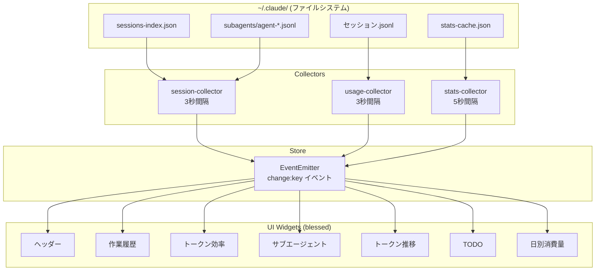
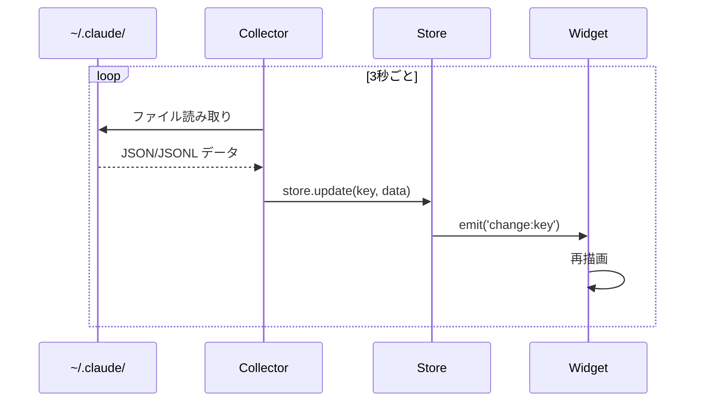

# Claude Code の監視ダッシュボードを対話だけで作った話

> リポジトリ: [github.com/SimWook/claude-monitor](https://github.com/SimWook/claude-monitor)

---

## 1. ダッシュボード全体設計

Claude Code の稼働状況をターミナル1画面で把握したい。レイアウト案とウィジェット仕様を渡して、一括で実装させた。

> **プロンプト（要約）**
> 以下のプランを実装してくれ:
> - 作業履歴 (6行, Branch/Summary/Age)
> - トークン効率ゲージ (Cache Hit% / Output% / Today/Avg)
> - サブエージェント監視パネル
> - トークン推移チャート、日別消費バーチャート
> - レイアウト: 12x12 grid で配置

**出力結果**: 7ウィジェット + コレクター群 + Store を一括生成。27ファイル、約2,500行。

```
claude-monitor/
├── bin/claude-monitor.js          # CLI (on/off/toggle/status)
├── src/
│   ├── store.js                   # EventEmitter 状態管理
│   ├── collectors/                # ファイルシステムからデータ収集
│   │   ├── session-collector.js
│   │   ├── usage-collector.js
│   │   └── ...
│   └── ui/widgets/                # 各ウィジェット
│       ├── work-history.js
│       ├── token-budget.js
│       ├── agent-panel.js
│       └── ...
└── package.json
```

<!-- ここに初回ダッシュボードのスクリーンショット -->

---

## 2. 「このグラフ意味わからない」→ バーチャートに変更

sparkline で7日間トークンを表示したが、数値もラベルもなく何のグラフか不明だった。

> **プロンプト**
> Daily Tokens (7d) -- Today: 72M このグラフの意味はよくわからないと思うのでもっといい感じにしてくれ

**出力結果**: sparkline を `contrib.bar` に置換。日付ラベル (`19(水)` 形式) + 百万単位の消費量を表示するバーチャートに変更。

<!-- ここに変更後のスクリーンショット -->

---

## 3. 全ラベルの日本語化

ウィジェットのラベルが英語で、何を表示しているか直感的に分からなかった。

> **プロンプト**
> Weekly Activityで何を表示しているのかわからないため。説明とか明確に書いてくれ。他のところも一緒。システム設定が日本語なら日本語で英語なら英語にしてくれ。

**出力結果**: 全ウィジェットのラベルを日本語化。

| Before | After |
|---|---|
| Weekly Activity | 日別トークン消費量 (百万) |
| Token Budget | トークン効率 (週間) |
| Work History | 作業履歴 (*=稼働 ~=1h以内) |
| Sub-Agents | サブエージェント |

---

## 4. ヘッダー情報の精度修正

モデル名が過去の累計ベースで `opus 4.5` と表示され、稼働中セッションも 0 のままだった。

> **プロンプト**
> CLAUDE MONITOR | モデル: opus 4.5 | 稼働中: 0 | 費用: $106.26 これも修正してくれ

**出力結果**: JSONL ファイルの `message.model` フィールドから現在のモデル名を取得。ファイルの mtime で稼働中セッションを判定するように変更。

```javascript
// 最新のJSONLファイルからモデル名を抽出
const lines = content.trim().split('\n');
for (let i = lines.length - 1; i >= 0; i--) {
  const obj = JSON.parse(lines[i]);
  if (obj.message?.model) {
    return formatModelName(obj.message.model); // → "opus 4.6"
  }
}
```

---

## 5. ターミナルリサイズ対応

ウィンドウを広げるとウィジェットが崩れる問題。

> **プロンプト**
> 稼働中の場合、ターミナルを大きくすると表示とか中のものが崩れるのでターミナルサイズに従うデザインに変更してくれ

**出力結果**: デバウンス付きリサイズハンドラーを追加。`screen.realloc()` で再計算後、全ウィジェットに再描画イベントを発火。

```javascript
screen.on('resize', () => {
  clearTimeout(resizeTimer);
  resizeTimer = setTimeout(() => {
    screen.realloc();
    for (const key of Object.keys(store.state)) {
      store.emit(`change:${key}`, store.state[key]);
    }
    screen.render();
  }, 150);
});
```

> **注意点**: Canvas系ウィジェット (line/bar) は `setData()` を再呼び出ししないとサイズが追従しない。`change` イベントの再発火で各ウィジェットの `update()` が走り、内部的に `calcSize()` される。

---

## 6. TODO 機能の追加

セッション横断で「次にやること」を管理したかった。

> **プロンプト**
> 作業履歴でTODOマークつけると次にclaudeコードを開いた時にアラートとかTODOリストで次にやる作業ですといつ登録したか内容も追記して。完了したら完了でTODOに見えないような感じもできる？

**出力結果**: `t` キーでTODO状態を3段階遷移。 `~/.claude-monitor-todos.json` に永続化。



---

## 7. TODO選択のバグ修正

`t` を押すと選択行の1つ上の行がTODO登録されるバグ。

> **プロンプト**
> バグがあるけど。tを押すと上のところがチェックしちゃう。それとセッションが保存されない。

**出力結果**: `contrib.table` の `rows.selected` はヘッダーを含まない（0 = 最初のデータ行）。`selected - 1` としていたオフバイワンエラーを修正。

> **注意点**: blessed-contrib の table は内部的に `blessed.list` を使っており、ヘッダーは別要素。ドキュメントに明記されておらず、実際に検証して判明した。

---

## 8. 操作ログ → TODO パネルに置換

操作ログパネルの有用性が低く、TODOの方が実用的だった。

> **プロンプト**
> 操作ログの方を消してTODOとか次にやる作業のリストを書いたら良いかと。それとサブエージェント起動状況把握コードが消されたぽいだけど復活してくれ。

**出力結果**: event-log.js を todo-panel.js に置換。pendingは黄色□マーク、completedは灰色✓マーク、登録日時付き。サブエージェント検出コードも復元。

<!-- ここにTODOパネルのスクリーンショット -->

---

## 9. サブエージェントの担当タスク表示

エージェントIDだけでは何をしているか分からない。

> **プロンプト**
> サブエージェント使う時になんの担当をしているかを確認できる？

**出力結果**: エージェントのJSONLファイルの最初の行（初回ユーザーメッセージ）からタスク内容を抽出して表示。4KBだけ読み取るため負荷は最小限。

```
 サブエージェント (3稼働中)
 a8c3e2  5s  workspace
  claude-monitorダッシュボー..
 24981b 12s  Mikasa-Srv
  認証フローのE2Eテスト実装..
 31df17 25s  Mikasa-Srv
  UserControllerのAPI仕様書..
```



---

## 10. リポジトリ公開・リリース

> **プロンプト**
> レポジトリを作ってコミットプッシュして。READMEも作成して。publicでよい。

**出力結果**: GitHub リポジトリ作成、README生成、`v0.1.0-beta` としてリリース。

- リポジトリ: [github.com/SimWook/claude-monitor](https://github.com/SimWook/claude-monitor)
- リリース: [v0.1.0-beta](https://github.com/SimWook/claude-monitor/releases/tag/v0.1.0-beta)

---

## アーキテクチャ





---

## ダッシュボードレイアウト

```
┌─────────────────── HEADER ────────────────────┐
│ CLAUDE MONITOR | モデル: opus 4.6 | 稼働中: 1  │
├────────────────────────┬──────────────────────┤
│                        │ トークン効率          │
│                        │  Cache命中 ████░ 80% │
│     作業履歴            │  出力比率  ██░░░ 12% │
│  (セッション一覧)       │  本日/平均 ███░░ 67% │
│  [t] でTODO切替        ├──────────────────────┤
│                        │ サブエージェント       │
│                        │  a8c3e2  5s workspace │
│                        │   ダッシュボード調査.. │
├────────────────────────┬──────────────────────┤
│                        │                      │
│  トークン推移 (7日間)    │  TODO (3件)          │
│  キャッシュ vs I/O      │  □ workspace 調査..  │
│                        │  ✓ Mikasa 認証実装   │
├────────────────────────┴──────────────────────┤
│  日別トークン消費量 (7日間)                      │
│  ▓▓▓ ▓▓ ▓▓▓▓ ▓▓▓ ▓▓ ▓▓▓▓ ▓▓               │
└───────────────────────────────────────────────┘
```

<!-- ここに実際のスクリーンショット -->

---

## セットアップ

```bash
git clone https://github.com/SimWook/claude-monitor.git
cd claude-monitor
npm install
node bin/claude-monitor.js on
```

### Claude Code フックで自動起動

`~/.claude/hooks.json` に追加すると、Claude Code 起動のたびにダッシュボードが自動で立ち上がる。

```json
{
  "hooks": [
    {
      "matcher": "SessionStart",
      "hooks": [
        {
          "type": "command",
          "command": "node /path/to/claude-monitor/bin/claude-monitor.js on 2>/dev/null || true"
        }
      ]
    }
  ]
}
```

---

## まとめ

| 項目 | 内容 |
|---|---|
| 開発時間 | 約2時間（Claude Code との対話のみ） |
| 総コード量 | 約2,500行 / 27ファイル |
| プロンプト回数 | 約15回（設計1回 + 修正・機能追加14回） |
| 使用技術 | Node.js, blessed, blessed-contrib, EventEmitter |

Claude Code に対して「作って」「直して」「変えて」を繰り返すだけで、実用的な監視ツールが完成しました。特に**フィードバックループの速さ**がポイントで、「このグラフ意味わからない」→ 即修正 → 確認のサイクルを高速に回せました。

> リポジトリ: [github.com/SimWook/claude-monitor](https://github.com/SimWook/claude-monitor)
